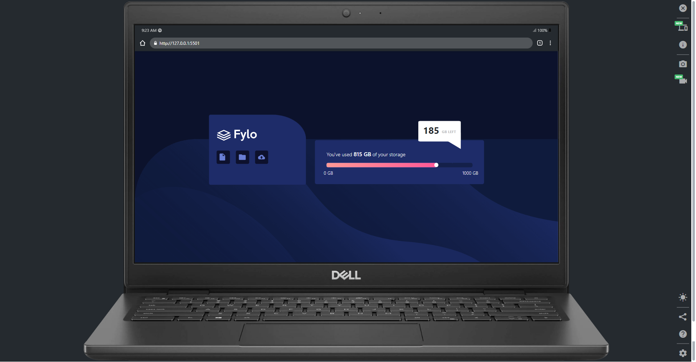
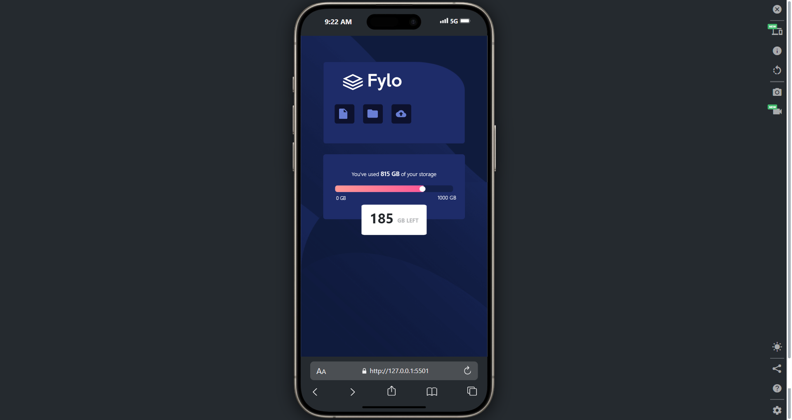

## Overview

### The challenge

Users should be able to:

- View the optimal layout for the site depending on their device's screen size

### Screenshot

**Note: Delete this note and the paragraphs above when you add your screenshot. If you prefer not to add a screenshot, feel free to remove this entire section.**

### Links

- Live Site URL: [SBA326](https://webdesign-multimedia.github.io/SBA326/)

# My process

### Built with

- Semantic HTML5 markup
- CSS custom properties
- Flexbox
- Bootstrap Components
- Mobile-first workflow

**Note: These are just examples. Delete this note and replace the list above with your own choices**

